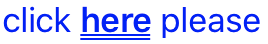

# StringUntagger

<a href="https://github.com/nacho4d/StringUntagger/actions"></a>

A simple class to convert tagged strings to attributed strings. This is specially useful when strings are attributed and localized.

Simplest example:

```swift
let res = "click <b>here</b> please".attributedString(attributter: [
    "root": [ .foregroundColor: UIColor.blue, .font: UIFont.systemFont(ofSize: 17)],
    "b": [ .font: UIFont.boldSystemFont(ofSize: 17), .underlineStyle: NSUnderlineStyle.double.rawValue ]
])
```
    
Will result in: 

 
    
If "root" is not good for your cases, it can be customized too:

```swift
let su = StringUntagger(rootName: "MyCustomRootName")
let res = su.attributedString(from: "start <root>this is the middle</root> end", attributer: [
    "MyCustomRootName": [ .foregroundColor: UIColor.lightGray, .font: UIFont.systemFont(ofSize: 12)],
    "root": [ .foregroundColor: UIColor.blue],
])
```
    
There is also a block base API that should give full control. Check the tests to find out more :)

MIT Licence

